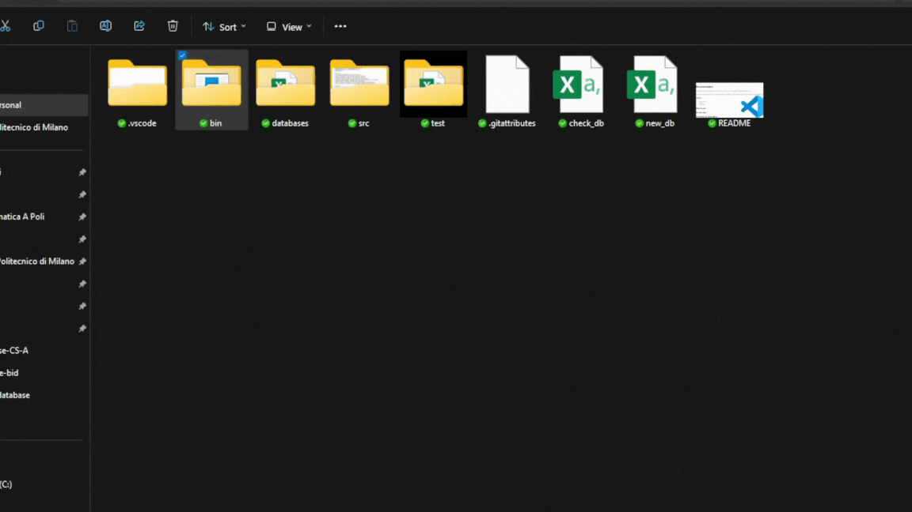
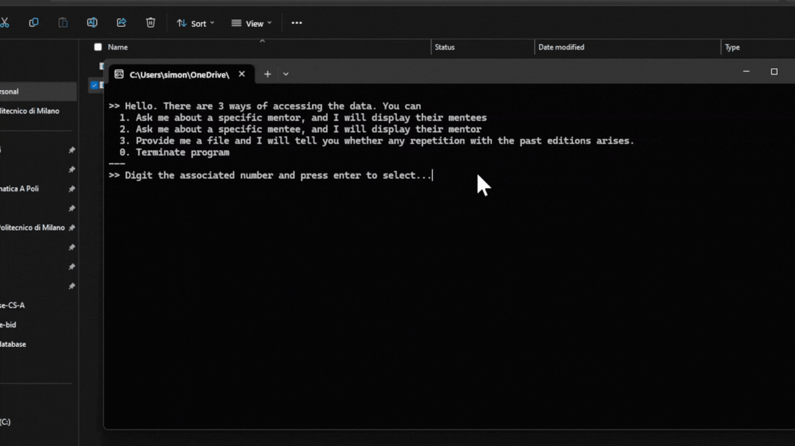
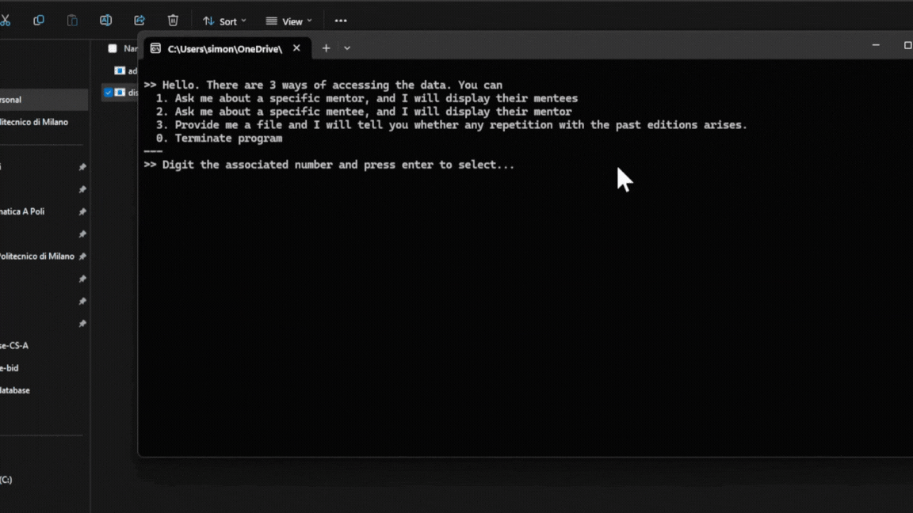
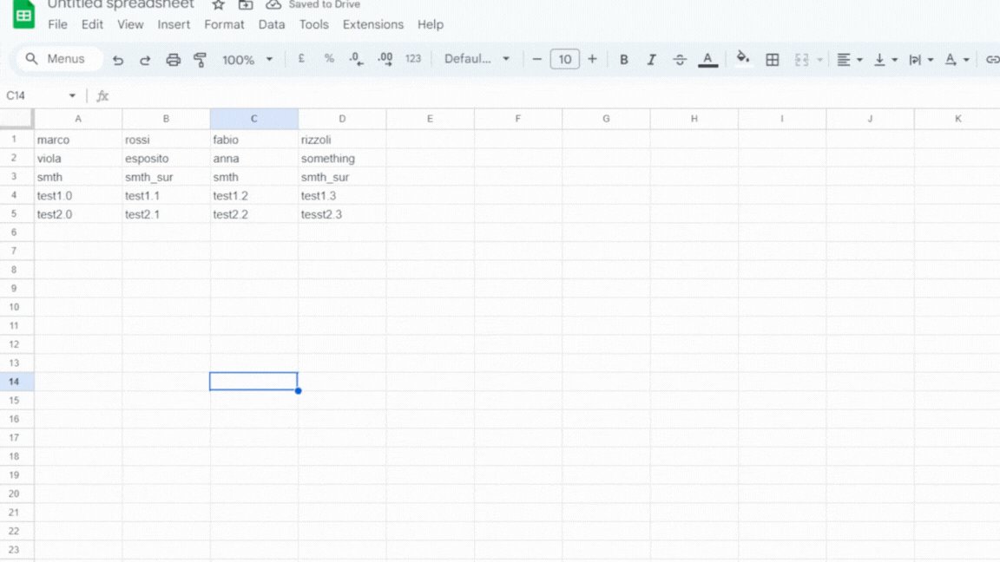
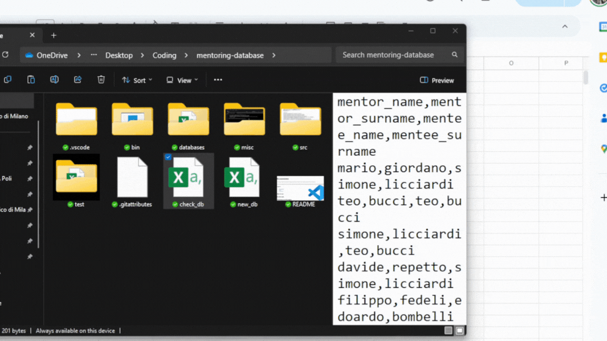

# Read me

This repo contains C command line interface and tools to update, view, and confront AIM Mentoring past pairings with the new ones.

It has been curated by Simone Licciardi (contacts: @SimoneTBIR, simone.licciardi@mail.polimi.it), for the project AIM Mentoring.

### Legend:
- [User manual](#how-to-use)
- [Code](#on-the-code)
- [Comments](#comments-on-the-project)

## How to use

The tools allow the user to
1. **Add the pairings from new editions to the database**. That is, at the end of each year program it allows to keep the database updated. The prodcedure consists in filling "new_db.csv" with the (properly formatted) new pairings and then execute "bin/add.exe".
2. **Display the mentors of a specific mentee**, by executing "bin/display.exe" and selecting the proper voice in the menu.
2. **Display the mentees of a specific mentor**, by executing "bin/display.exe" and selecting the proper voice in the menu.
3. **Confront the proposal of current editions pairings with past pairings**, in order to avoid repetitions over the years. Again, this is a function of "bin/display.exe", with the caveat that you need to insert the (properly formatted) new pairings in the file "check_db.csv".

### Add new pairings to the database
At the end of the program, it is sufficient to create (with excel, or google sheet) a file formatted like "test/new_db.csv", and substitue it to "new_db.csv" (note: you should remove the empty file and then rename the new oen "new_db.csv". Pay attention to including the header!). Then, you should run "bin/add.exe". The databases will be updated with the new data.

### Display the mentors of a specific mentee / Display the mentees of a specific mentor
Start running "bin/display.exe".

Select the proper menu voice (1 for mentees of a mentor, 2 for mentors of a mentee), insert the name, then the surname of the person. The result will be displayed.

Type 0 to terminate the program once you are done.

### Confront the proposal of current editions pairings with past pairings
It is paramount that over the years we do not repeat the same pairing twice. In order to check this, export the csv file formatted as "nome_mentor,cognome_mentor,nome_mentee,cognome_mentee" and then replace the file check_db.csv with it. ACHTUNG: you need to add the header as first row of this new file.

Then, run "bin/display.exe", selecting option 3. You may then either
1. Not see an error warning (this is the desired output!)

2. See an error warning (then, you **have** to change that pairing)

## On the code

Don't really know what to pu here

## Comments on the project

Was never used and will never because AIM prefers to use Excel functions. A shame, if you ask me. But it was interesting to make.